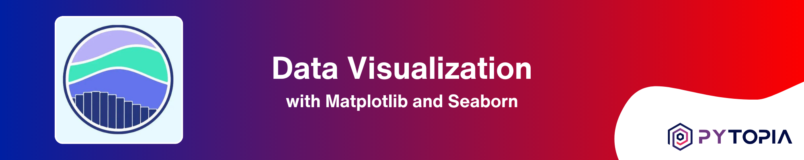

[](https://www.pytopia.ai)
[](https://t.me/pytopia_ai)
[](https://instagram.com/pytopia.ai)
[](https://www.youtube.com/@pytopia)
[](https://linkedin.com/company/pytopia)
[](https://twitter.com/pytopia_ai)

Welcome to the Data Visualization for Machine Learning course repository! This practical course is designed to equip you with the essential skills and techniques for creating compelling and informative visualizations that are crucial in the field of Machine Learning. Whether you're a beginner looking to enhance your data visualization capabilities or an experienced practitioner seeking to leverage visualizations for better insights, this course has something to offer.

# 🎯 Course Objectives

By the end of this course, you will:

- Understand the fundamental principles and best practices of data visualization
- Master the popular data visualization libraries: Matplotlib, Seaborn, and Pandas
- Create a wide range of visualizations, from basic plots to advanced statistical graphics
- Learn how to customize and fine-tune your visualizations for maximum impact
- Gain hands-on experience through real-world projects that simulate Machine Learning scenarios
- Discover how effective data visualization can enhance your Machine Learning workflow

# 📚 Course Contents

The course is divided into the following chapters:

1. Introduction to Data Visualization
2. Getting Started with Matplotlib
3. Basic Plotting with Matplotlib
4. Advanced Matplotlib Concepts
5. Introduction to Seaborn
6. Statistical Plotting with Seaborn
7. Customizing Seaborn Plots
8. Data Visualization with Pandas
9. Real-world Projects

Each chapter includes a combination of theoretical explanations, practical examples, and hands-on exercises to reinforce your understanding of the concepts and their applications in Machine Learning. The real-world projects in the final chapter provide you with the opportunity to apply your data visualization skills to realistic Machine Learning scenarios, giving you valuable experience and a portfolio of visualizations to showcase.

# ✅ Prerequisites

To get the most out of this course, you should have:

- Basic knowledge of Python programming
- Basic familiarity with data manipulation using libraries like NumPy and Pandas
- Enthusiasm to explore the power of data visualization in Machine Learning!

# 📚 Learn with Us!
We also offer a [course on these contents](https://www.pytopia.ai/courses/data-visualization) where learners can interact with peers and instructors, ask questions, and participate in online coding sessions. By registering for the course, you also gain access to our dedicated Telegram group. Enroll now and start learning! Here are some useful links:

- [Data Visualization Course](https://www.pytopia.ai/courses/data-visualization)
- [Pytopia Public Telegram Group](https://t.me/pytopia_ai)
- [Pytopia Website](https://www.pytopia.ai/)

[](https://www.pytopia.ai/courses/data-visualization)

# 🚀 Getting Started

To get started with the course, follow these steps:

1. Clone this repository to your local machine using the following command:
   ```
   git clone https://github.com/pytopia/data-visualization.git
   ```

2. Navigate to the cloned repository:
   ```
   cd data-visualization
   ```

3. Set up the required dependencies and environment by following the instructions in the `setup.md` file.

4. Start exploring the course materials, beginning with the first chapter.

Throughout the course, you will learn how to create visually appealing and informative plots, charts, and graphs that can help you gain insights from your data, communicate findings effectively, and enhance your Machine Learning models. By the end of this course, you will have a strong foundation in data visualization techniques and be able to apply them confidently in your Machine Learning projects.

# 📞 Contact Information

Feel free to reach out to us!

- 🌐 Website: [pytopia.ia](https://www.pytopia.ai)
- 💬 Telegram: [pytopia_ai](https://t.me/pytopia_ai)
- 🎥 YouTube: [pytopia](https://www.youtube.com/@pytopia)
- 📸 Instagram: [pytopia.ai](https://www.instagram.com/pytopia.ai)
- 🎓 LinkedIn: [pytopia](https://www.linkedin.com/in/pytopia)
- 🐦 Twitter: [pytopia_ai](https://twitter.com/pytopia_ai)
- 📧 Email: [pytopia.ai@gmail.com](mailto:pytopia.ai@gmail.com)
